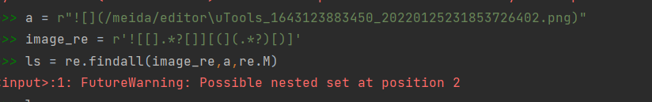

+++
title="FutureWarning Possible nested set at position 2"
description="正则表达式优化：FutureWarning Possible nested set at position 2"
date="2022-03-08 23:06:00+08:00"
image=""
tags=["re","python",]
categories=["坑点速记",]
series=["Themes Guide"]
aliases=["migrate-from-jekyl"]
+++
[toc]
# FutureWarning: Possible nested set at position 2
对md文件进行保存时使用正则表达式对内容里的图片名称地址进行提取，以便拷贝图片至hugo目录下

原始正则表达式：

`image_re = r'![[].*?[]][(](.*?)[)]'`

报错：


优化后：

`image_re = r'![\[].*?[]][(](.*?)[)]'`

其他情况下的处理：

修改正则表达式中的匹配 [ [ ] 为 [ \[ ] 以此解决问题