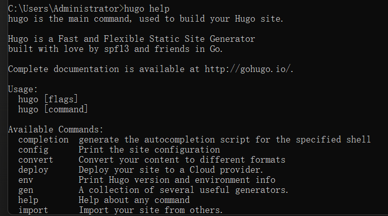
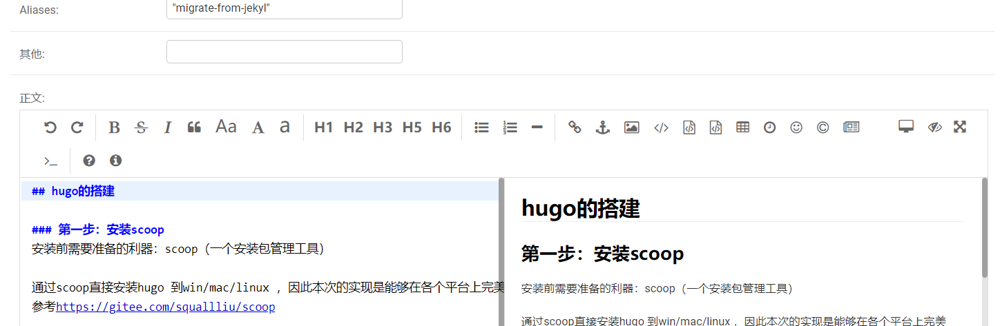

+++
title="hugo+django+githubPage 个人博客搭建（一）"
description="使用hugo生成静态网页，使用django做后台进行博客的管理，使用githubPage进行页面展示"
date="2022-03-07 23:45:00+08:00"
image="uTools_1642688324700.png"
tags=["hugo","django","githubpage",]
categories=["博客搭建",]
series=["Themes Guide"]
aliases=["migrate-from-jekyl"]
+++
## hugo的搭建

### 第一步：安装scoop
安装前需要准备的利器：scoop（一个安装包管理工具）

通过scoop直接安装hugo 到win/mac/linux ，因此本次的实现是能够在各个平台上完美兼容的。
参考https://gitee.com/squallliu/scoop

### 第二步：hugo安装
在命令行中输入安装命令即可
scoop install hugo
安装完成后输入hugo help 即可查询到hugo的基本使用


### 第三步：新建hugo本地文件
因为本次是和django项目结合在一起，可以计划一个文件夹，里面保证django和hugo在同一级目录下


## dajngo搭建
使用pycharm专业版搭建，并新建一个hugo app。
使用到的命令为：
`python manage.py create hugo`


此外，hugo文章的编辑规则为markdown,在此我选择使用的是django-mdeditor
可以为数据库字段提供md的编辑框。

如下：


## githubPage准备
直接参考官方指导即可：
https://pages.github.com/